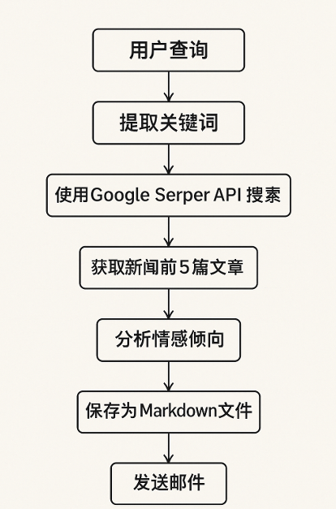

# simple-mcp-client-server

## 需求分析
本项目旨在构建一个本地智能舆情分析系统，通过自然语言处理与多工具协作，实现用户查询意图的自动理解、新闻检索、情绪分析、结构化输出与邮件推送。具体如下：



## 开发步骤
创建python虚拟环境, 同时安装uv
```python
pip install uv
```

通过uv创建mcp项目
```python
uv init mcp-project
```

安装必要的依赖
```python
pip install xxx
```

测试的时候只需要运行client.py就可以运行整个项目了。

client.py会主动连接server.py

## 调试过程
安装必要的python插件, 以下四个
- python
- pylance
- python debugger
- python enviroments

F5或者点击文件右上角的调试按钮直接调试

推荐创建vscode标准的./vscode/lanch.json配置文件, 这样你可以更全面的掌控项目的调试配置, 支持以下调试模式
- File ,调试当前文件
- Attach ,远程调试, 选择Attach using Process ID
- Django ,指定"program": "${workspaceFolder}/manage.py","args": ["runserver"]. 还添加了"django": true启用 Django HTML 模板调试的功能。
- Flask	, "module": "flask",
- Gevent, 添加"gevent": true到标准集成终端配置中。
- Pyramid, 删除program、添加"args": ["${workspaceFolder}/development.ini"]、添加"jinja": true以启用模板调试，并添加以确保使用必要的命令"pyramid": true启动程序。pserve

> https://vscode.github.net.cn/docs/python/debugging
> https://vscode.github.net.cn/docs/python/debugging#_debugging-specific-app-types